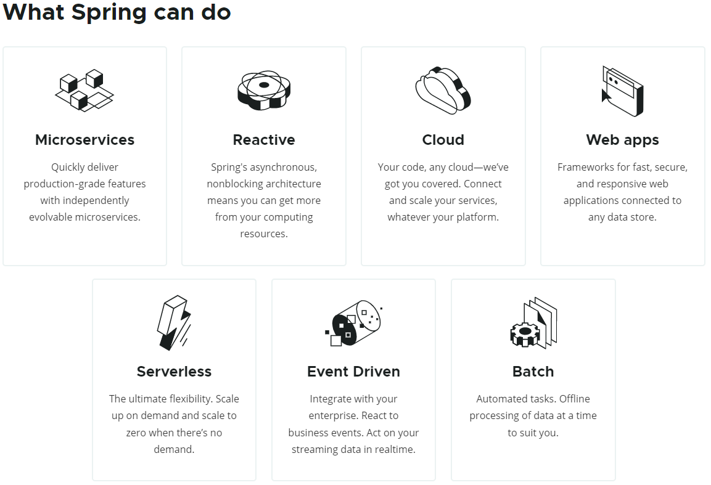
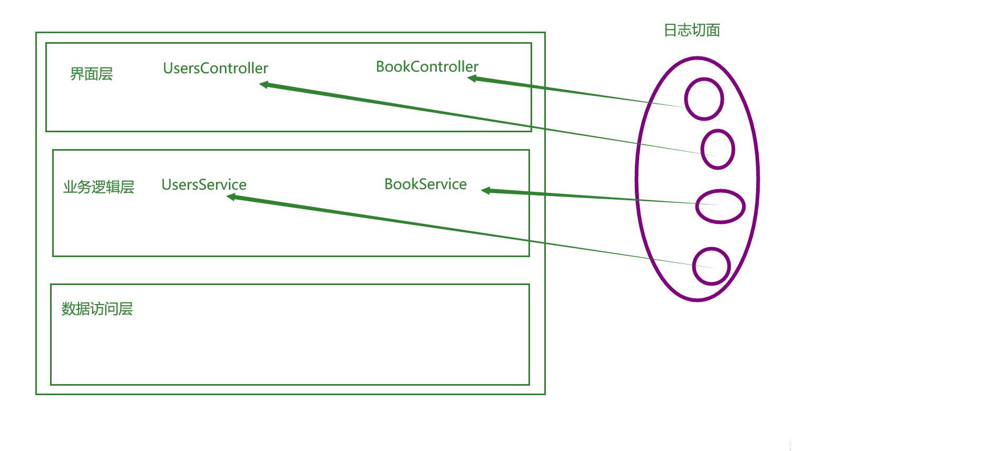
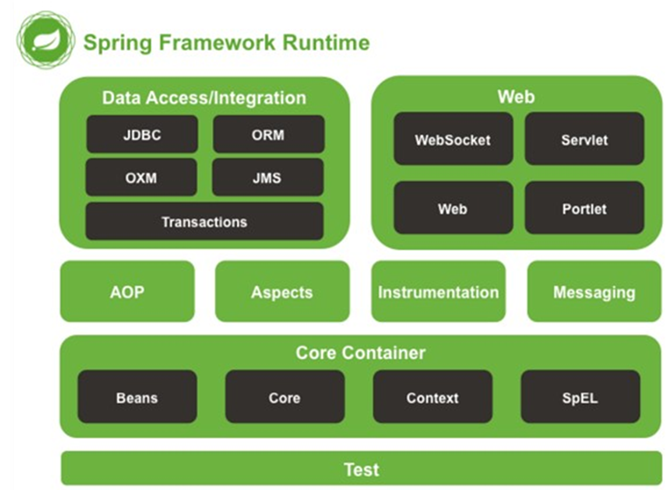
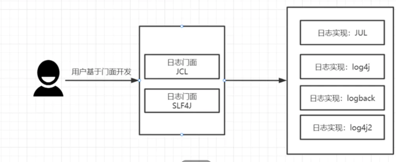
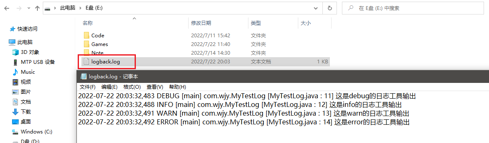
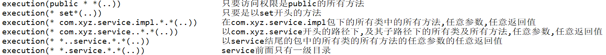
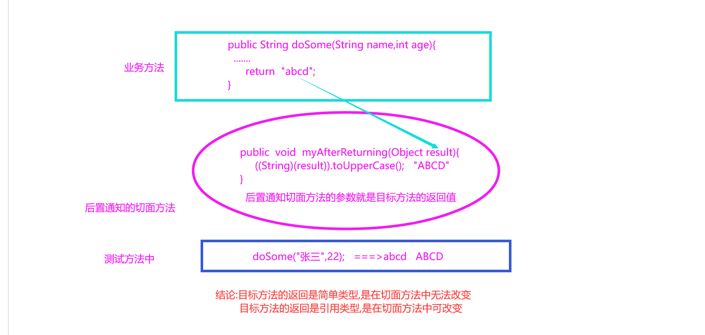
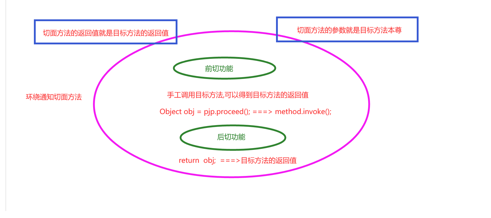

# Chapter1 OVERVIEW

容器，用来整合其它框架的框架。

它是一个大的家族,由20多个模块构成。提供了web应用开发，移动开发，响应式处理，云存储，批处理等领域非常优秀的解决方案。

它的核心是IoC 和AOP。



## Section 1-1: Features

- [Core technologies](https://docs.spring.io/spring-framework/docs/current/spring-framework-reference/core.html): **dependency injection**(依赖注入), events, resources, i18n ( 国际化 internationalization ), validation( 验证 ), data binding( 数据绑定 ), type conversion( 类型转换 ), SpEL, **AOP**.
- [Testing](https://docs.spring.io/spring-framework/docs/current/spring-framework-reference/testing.html): mock objects, TestContext framework, Spring MVC Test, `WebTestClient`.

- [Data Access](https://docs.spring.io/spring-framework/docs/current/spring-framework-reference/data-access.html): transactions, DAO support, JDBC, ORM, Marshalling XML.
- [Spring MVC](https://docs.spring.io/spring/docs/current/spring-framework-reference/web.html) and [Spring WebFlux](https://docs.spring.io/spring/docs/current/spring-framework-reference/web-reactive.html) web frameworks.

## Section 1-2: 优点

1. 轻量级：它的核心jar包都很小，每个jar包不到1M左右，核心jar加起来就3M左右。对代码无污染。

2. 面向接口编程：通过接口灵活关键功能，上接口就是上灵活。

    - 类中的成员变量设计为接口
    - 方法的参数设计为接口
    - 方法的返回值设计为接口
    - 调用时接口指向实现类

3. 面向切面编程：

    - 切面就是公共的，通用的，重复的功能。例如：日志、权限验证、事务等。

    - 面向切面编程：将切面单拎出去开发，在需要的方法调用时自动动态代理回来切面功能。

        

4. 它是整合其它框架的框架：它是一个大的容器。整合其它框架，使其更易用。

## Section 1-3: Spring体系结构



# Chapter2 IoC

控制反转IoC ( Inversion of Control ) 是一个概念，是一种思想。(让Spring来干活)。

- 什么控制：创建对象和依赖注入的控制权
- 什么反转：从程序员手中反转给Spring容器

IoC的实现技术DI ( Dependency Injection ) 依赖注入。

## Section 2-1: 基于xml的IOC的实现

### 步骤一：添加Spring框架

1. 添加Spring的依赖

    pom.xml

    ```xml
    	<dependency>
          <groupId>org.springframework</groupId>
          <artifactId>spring-context</artifactId>
          <version>5.2.5.RELEASE</version>
        </dependency>
    ```

2. 添加Spring的配置文件

    applicationContext.xml

### 步骤二：实现IoC

### 通过注解

1. 创建对象IoC

    使用< bean >标签创建对象

    **Spring容器在启动时创建对象时，类必须提供无参的构造方法。**

    applicationContext.xml

    ```zml
    <bean id="wjy" class="com.wjy.pojo.Student"></bean>
    ```

2. 注入值的IoC

    - 注入的类型分为:

        - 简单类型(8种基本类型+String)注入( value )

        - 引用类型(对象)注入( ref )

    - 注入的方式分为:

        - setter注入

            切记：一定要有无参的构造方法。一定要有对应的setXXX( ) 方法。

            ```xml
            	<!--创建学生对象-->
                <bean id="wjy" class="com.wjy.pojo.Student">
                    <property name="name" value="张三"></property>
                    <property name="age" value="28"></property>
                </bean>
            
                <!--创建学校对象-->
                <bean id="school" class="com.wjy.pojo.School">
                    <property name="student" ref="wjy"></property>
                </bean>
            ```

        - 构造方法注入

# Chapter3 AOP

面向切面编程。面向切面编程就是把切面单拎出去

> 切面：重复的功能或业务

## Section3-1 手写AOP框架

1. 第一个版本：事务切面和图书购买的业务耦合在一起。

2. 第二个版本：使用子类代理的方式将事务的切面和图书购买的业务分离开，再整合在一起。

3. 第三个版本：使用静态代理的方式将事务的切面和图书购买业务分离开，再整合在一起。

    > 静态代理规定:
    >
    > 要有业务接口
    >
    > 要有业务实现类
    >
    > 要有代理类，它也必须实现业务接口,完成业务和切面的整合

4. 第四个版本：使用静态代理的方式拆分出业务接口和实现、拆分出切面接口和实现，再整合在一起。

5. 第五个版本：使用动态代理整合切面和业务。接近Spring原生的AOP。

## Section3-2 日志框架

日志在项目开发以及上线中非常重要。



添加日志框架的步骤

1. 添加依赖pom.xml

    ```xml
    	<dependency>
          <groupId>ch.qos.logback</groupId>
          <artifactId>logback-classic</artifactId>
          <version>1.2.3</version>
        </dependency>
    ```

2. 添加日志配置（固定）

    ```xml
    <?xml version="1.0" encoding="UTF-8"?>
    <!--
      scan,当此属性设置为true时，配置文件如果发生改变，将会被重新加载，默认值为true。
      scanPeriod,设置监测配置文件是否有修改的时间间隔，如果没有给出时间单位，默认单位是毫秒。当scan为true时，此属性生效。默认的时间间隔为1分钟。
      debug,当此属性设置为true时，将打印出logback内部日志信息，实时查看logback运行状态。默认值为false。
    -->
    <configuration debug="false" scan="true" scanPeriod="1 seconds">
    
        <!--
        contextName ，设置日志上下文名称，可以通过%contextName来打印日志上下文名称
        -->
        <contextName>logback</contextName>
        <!--
        property可以用来设置变量，可以通过${name}来访问，有以下的属性
            name，用于${name}访问的key
            value，用于${name}访问的value
            file ，用于指定配置文件的路径，他的作用在于，如果你有多个配置信息的话，可以直接写在配置文件中，然后通过file引入
                   <property file="src/main/java/chapters/configuration/variables.properties" />
            resource作用和file一样，但是，它是可以直接从classpath路径下引入配置文件
                   <property resource="resource.properties" />
        -->
        <property name="log.path" value="E:\\logback.log"/>
        <!--
        appender格式化日志输出节点，有俩个属性name和class，class用来指定哪种输出策略，常用就是控制台输出策略和文件输出策略。
        -->
        <appender name="console" class="ch.qos.logback.core.ConsoleAppender">
            <!-- <filter class="com.example.logback.filter.MyFilter" /> -->
            <!--
            系统定义的拦截器，例如我们用ThresholdFilter来过滤掉INFO级别以下的日志不输出到控制台中
            -->
            <filter class="ch.qos.logback.classic.filter.ThresholdFilter">
                <!--
                Logger可以被分配级别。级别包括：TRACE、DEBUG、INFO、WARN和ERROR，
               程序会打印高于或等于所设置级别的日志，设置的日志等级越高，打印出来的日志就越少。
               如果设置级别为INFO，则优先级高于等于INFO级别（如：INFO、 WARN、ERROR）的日志信息将可以被输出,小于该级别的如DEBUG将不会被输出。为确保所有logger都能够最终继承一个级别，根logger总是有级别，默认情况下，这个级别是DEBUG。
                -->
                <level>INFO</level>
            </filter>
            <!--encoder和pattern节点组合用于具体输出的日志格式-->
            <encoder>
                <pattern>%d{HH:mm:ss.SSS} %contextName [%thread] %-5level %logger{36} - %msg%n
                </pattern>
            </encoder>
        </appender>
        <appender name="file"
                  class="ch.qos.logback.core.rolling.RollingFileAppender">
            <file>${log.path}</file>
            <!--
                rollingPolicy日志回滚策略，在这里我们用了TimeBasedRollingPolicy，基于时间的回滚策略,有以下子节点
                fileNamePattern，必要节点，可以用来设置指定时间的日志归档，例如我们上面的例子是每天将日志归档成一个zip包
                maxHistory ,可选节点，控制保留的归档文件的最大数量，超出数量就删除旧文件,，例如设置为30的话，则30天之后，旧的日志就会被删除
                totalSizeCap，可选节点，用来指定日志文件的上限大小，例如设置为3GB的话，那么到了这个值，就会删除旧的日志
    -->
            <rollingPolicy class="ch.qos.logback.core.rolling.TimeBasedRollingPolicy">
                <fileNamePattern>${log.path}.%d{yyyy-MM-dd}.zip</fileNamePattern>
            </rollingPolicy>
            <encoder>
                <!--
                %logger{36} 表示logger名字最长36个字符，否则按照句点分割
                %date{HH:mm:ss.SSS}输出日志的打印日志，模式语法与java.text.SimpleDateFormat 兼容。看上去%d就已经够好了
                可选的格式修饰符位于“%”和转换符之间。第一个可选修饰符是左对齐标志，符号是减号“-”；
                m / msg / message 输出应用程序提供的信息。
                t / thread 输出产生日志的线程名。
                p / le / level输出日志级别。
                -->
                <pattern>%date %level [%thread] %logger{36} [%file : %line] %msg%n
                </pattern>
            </encoder>
        </appender>
        <!--
        root节点，必选节点，用来指定最基础的日志输出级别，他有俩个节点可以用来应用appender，格式化日志输出
        -->
        <root level="debug">
            <appender-ref ref="console"/>
            <appender-ref ref="file"/>
        </root>
        <!--logger节点，可选节点，用来具体指明包的日志输出级别，它将会覆盖root的输出级别-->
        <!--<logger name="com.example.logback" level="warn" />-->
    </configuration>
            <!--
                <dependency>
                  <groupId>ch.qos.logback</groupId>
                  <artifactId>logback-classic</artifactId>
                  <version>1.2.11</version>
                </dependency>
            
                 private static final Logger LOGGER= LoggerFactory.getLogger(Agent.class);
                 LOGGER.info("事务开启...........");
            -->
    ```

3. 使用日志工具输出 

    ```java
    import org.junit.Test;
    import org.slf4j.Logger;
    import org.slf4j.LoggerFactory;
    
    public class MyTestLog {
        private static final Logger logger = LoggerFactory.getLogger(MyTestLog.class);
        @Test
        public void test01(){
            logger.debug("这是debug的日志工具输出");
            logger.info("这是info的日志工具输出");
            logger.warn("这是warn的日志工具输出");
            logger.error("这是error的日志工具输出");
        }
    }
    ```

    


## Section3-3 AOP常见术语

|                 |                                                              |
| --------------- | ------------------------------------------------------------ |
| 切面Aspect      | 所有的公共的通用的重复的功能或逻辑称为切面                   |
| 连接点JoinPoint | 就是用来切入切面功能的目标方法。用它来连接业务功能和切面。   |
| 切入点Pointcut  | 多个连接点称为切入点。 就是指定切入的位置                    |
| 目标对象Target  | 对谁操作谁就是目标对象。BookServiceImpl，ProductServiceImpl等。 |
| 通知Advice      | 指定切入的时机。前切，后切，环绕切，出错切等。               |

重点：切入点指定切入的位置，通知指定切入的时机。

## Section3-4 AspectJ框架

 它是一个面向切的非常优秀的框架。它是基于java语言开发的，所以无缝扩展功能。

### 一、常见通知

|                 |                                                              |
| --------------- | ------------------------------------------------------------ |
| @Before         | 前置通知，在目标方法执行前切入切面功能                       |
| @AfterReturning | 后置通知，在目标方法执行后切入切面功能.                      |
| @Around         | 环绕通知，在目标方法执行前后都切入切面功能，是通过拦截目标方法实现的 |
| @After          | 最终通知， 不管目标方法是否正常执行，都会执行切面功能        |
| @Pointcut       | 给切入点表达式起别名                                         |

### 二、切入点表达式

- execution(访问权限 方法返回值 方法声明(参数) 异常类型),其中访问权限和异常类型可省略

- execution( 方法返回值 方法声明(参数))

常见符号解析:

|      |                                                              |
| ---- | ------------------------------------------------------------ |
| *    | 代表任意字符,可以出现在方法的返回值位置 ,出现在路径中...     |
| ..   | 出现在方法的参数中,代表任意参数                              |
|      | 出现在路径中,代表当前包下的所有子类,及所有类,及类中的所有方法 |

例题：



### 三、@Before前置通知

在业务方法执行前切入切面功能。

#### 添加AspectJ的框架的步骤：

1. 添加依赖spring，AspectJ
2. 完成业务接口创建，完成业务功能实现
3. 创建切面类，添加切面方法完成切面功能
4. 在applicationContext.xml配置文件中创建业务对象，创建切面对象，绑定业务和切面

#### 切面方法的规范

1. 访问权限是public

2. 切面方法没有返回值void

3. 切面方法名称自定义

4. 切面方法没有参数,如果有参数也是固定的JoinPoint类型

5. 使用@Before注解声明是前置通知

    > 参数value：指定切入点表达式

### 四、@AfterReturning后置通知

它是在目标方法执行后切入切面的功能。可以得到目标方法的返回值。是否可以更改目标方法的返回值要看目标方法返回值的类型。如果是简单类型(8种基本类型+String)则不可改变。如果是引用类型则可改变。



#### 后置通知切面方法的规范

​	     * 1)访问权限是public
​	     * 2)切面方法没有返回值void
​	     * 3)切面方法名称自定义
​	     * 4)切面方法可以没有参数(目标方法没有返回值),可以有参数,此参数就是目标方法的返回值,还可以有另外一个参数JoinPoint
​	     * 5)使用@AfterReturning注解声明是后置通知
​	     *   参数:
​	     *      value:指定切入点表达式
​	     *      returning: 指定目标方法返回值的名称,此名称要与切面方法的参数名称一致

### 五、@Around环绕通知

通过拦截目标方法，在其前后增强功能。事务使用的就是这种通知。环绕通知还可以控制目标方法的访问。



#### 环绕通知切面方法的规范

	     * 1)访问权限是public
	     * 2)切面方法有返回值,此返回值就是目标方法的返回值
	          * 3)切面方法名称自定义
	          * 4)切面方法有参数,参数就是目标方法
	               * 5)必须要回避异常Throwable
	               * 6)使用@Around注解声明是环绕通知
	                    *   参数:
	                    *     value:指定切入点表达式
