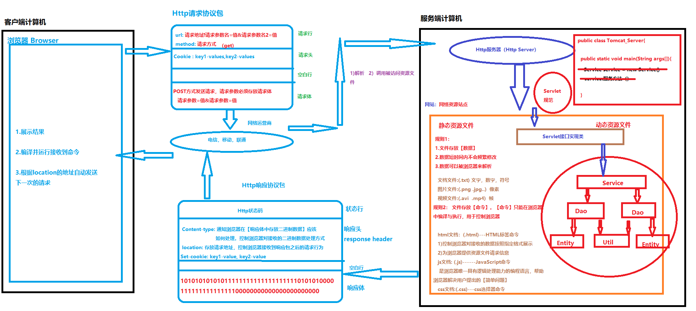

# 一、流程

HTTP请求协议包
请求方式Request Method 如果是GET放在请求行中，如果是POST放在请求体中
请求行
请求头

# 二、通过html命令为浏览器推送请求方式🌟
一共有7种 我们只研究GET和POST

GET请求方式：
1. 如果浏览器采用GET方式，此时GET方式要求浏览器在请求行中存放的请求参数的数量不能超过**4K**
2. 如果浏览器采用GET方式，此时GET方式要求浏览器必须在**地址栏**中展示推送的请求参数
3. 如果浏览器采用GET方式，此时GET方式要求浏览器必须将请求参数保存在**请求行**
4. 对于以GET方式得到资源。此时GET方式要求浏览器将【请求地址】与【返回资源】形成一个**键值对**保存在浏览器的**内存**中

POST请求方式：
1. 如果浏览器采用POST方式，此时POST方式**不会限制**浏览器写入到请求包中请求参数数量。
2. 如果浏览器采用POST方式，此时POST方式**禁止**浏览器在地址栏中展示请求参数信息
3. 如果浏览器采用POST方式，此时POST方式要求浏览器必须将请求参数写入到请求体
4. 对于以POST方式得到资源，此时POST方式禁止浏览器对返回资源进行缓存