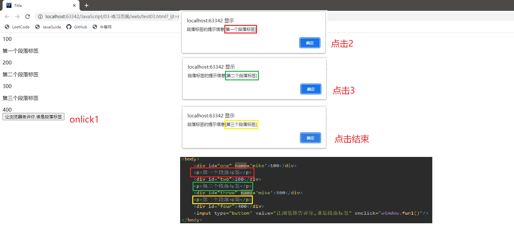

# 一、介绍
1. 在浏览器中编译与执行的编程语言
2. 弱类型编程风格
3. 区分英文字母大小写
# 二、学习目的
1. 帮助浏览器解决用户的简单问题
2. 为后续Jquery、VUE学习打下基础
# 三、如何书写JavaScript命令
## 方式一：在HTML中写

直接在HTML文件中< script >标签中书写JavaScript命令。在浏览器接收到HTML文件之后，自动使用JavaScript编译器对< script >标签中命令进行编译与执行
 - script标签建议写到< head >中
 - 一个html文件中可以有多个script标签，这些标签被认为是一个整体
```html
<!DOCTYPE html>  
<html lang="en">  
<head>  
    <meta charset="UTF-8">  
    <title>Title</title>  
    <script type="text/javascript">  
        var num1 = 100;  
        var num2 = 200;  
    </script>  
</head>  
<body>  
    <script type="text/javascript">  
        var num3 = num1 + num2;  
        window.alert(num3);//300  
    </script>  
</body>  
</html>
```
 - type="text/javascript
 - window指的接收当前html文件的浏览器
 - alert是windows对象内置函数，运动弹出一个对话框
```html
<head>  
    <meta charset="UTF-8">  
    <title>Title</title>
      
    <script type="text/javascript">  
	    window.alert("我是本地人");
    </script>  
</head>
```
- script里面的语句会被 . js 文件中的语句覆盖掉
```html
<script type="text/javascript" src="/01_JavaScript_war_exploded/one.js">  
    window.alert("我是地球人");//我是外星人 
</script>
```

 ## 方式二：在 . js文件中写
通过HTML文件中< script >标签加载到浏览器中执行

js文件不能写< script >。< script >是一个html标签命令，只能出现在html文件

js文件中直接书写javascript命令行
```javascript
window.alert("我是外星人");
```

```html
<head>  
    <meta charset="UTF-8">  
    <title>Title</title>  
    <script type="text/javascript" src="/01_JavaScript_war_exploded/one.js">  
  
    </script>  
</head>
```

# 四、变量
1. 变量使用规则：声明、初始化、使用
2. 标识符命名规则：类名、变量名、方法名、属性名

	字母、数字、下划线_、美元符号$
	
	不能以数字开头
	
	不能使用JavaScript关键字
3. 变量声明：
	
	JavaScript是弱类型编程语言。禁止使用具体的数据类型来修饰变量。要求使用修饰符var来修饰变量。
	```javascript
	var num1 = 123;
	```

# 五、数据类型分类
## 1.基本数据类型
- number类型：数字类型。整数and小数
- String类型：字符串类型 “ ” or ‘ ’
- boolean类型：true & false
## 2.引用数据类型
- Object类型：所有通过构造函数生成的对象都是object类型
- function类型：函数类型。类似于 Java 中的 java . lang . reflect . Method 类型
	- 所有script标签中的对象都被分配给了window对象
```javascript
function num1(p1,p2){
	命令行;
return p1+p2;
}
function num2(){

}

window.num2;
var x = window.function(1,2)；//3
```

## 3.数组
- JavaScript 中的数组其实就是 Java 中的 ArrayList
- JavaScript 中的一次性可以存储所种类型数据
-  JavaScript 中数组的内存的个数可变
- 声明方式：
	- var list = new Array();
	- var list2 = [ ] ;
```javascript
var list =[100,"abc",true];
```

# 六、JSON
在java中需要的到一个对象，这个对象的特征有一个deptNo,dname,loc属性，此时应该如何做。首先，需要创建一个拥有这些特征的类。
```java
public class Dept{
	public int deptNo;
	public String dname;
	public String loc;
}
```
然后，向JVM申请得到需要的对象
```java
Dept dept = new Dept();
```
JavaScript不需要自己声明一个类，需要何种特征的对象直接根据JavaScript编译器索要
json描述格式:向JavaScript编译器来索要我们需要的对象的
```javascript
var obj = {"属性名":"值1","属性名2":"值2"}；
```

```html
<script type="text/javascript">
	var dept ={"deptNo":10,"dname":"Accouting","loc":"NewYork"};
    window.alert("dept.deptNo = "+dept.deptNo+" dept.dname = "+dept.dname);
</script>
```
# 七、DOM对象
1. DOM对象=Document Object Model; 文档模型对象
2. DOM由浏览器负责创建
3. 每当浏览器解析出一个HTML标签时，负责在内存生成一个与之对应的管理对象，这个对象就是DOM对象
4. 开发人员无权对浏览器内存中的HTML标签进行直接操作如果需要操作则必须得到当前标签对应的DOM对象。开发人员----->dom----->< tr >< /tr >


# 八、document对象
1. document对象被称为文档对象
2. documetn对象由浏览器生成，负责管理DOM树
3. document对象帮助开发人员从DOM树得到开发人员需要的DOM对象

# 九、document定位DOM对象三种方式
 ## 1.根据标签的id属性值来定位DOM对象
```html
<div id="one"></div>
<div id="two"></div>
```
理论上来说一个HTML文件中不应该有id相同的标签

命令格式：寻找id等于one的标签所对应的DOM对象
```javascript
var dom = document.getElementById("one");
```
🌰
```html
<!DOCTYPE html>  
<html lang="en">  
<head>  
    <meta charset="UTF-8">  
    <title>Title</title>  
    <script type="text/javascript">  
        function fun1() {  
            //1.通过document得到id等于two的标签所对应的DOM对象  
            var dom = document.getElementById("two");  
            //2.要求dom对象将其管理的标签的【提示信息】读取来  
            var data =dom.innerHTML;  
            //3.将得到数据交给浏览器，给用户一个交代  
            window.alert("id等于two的标签的提示信息是【"+data+"】");  
        }  
    </script>  
</head>  
<body>  
    <div id="one">100</div>  
    <div id="two">200</div>  
    <div id="three">300</div>  
    <input type="button" value="让浏览器告诉你,谁是id等于two的标签" onclick="window.fun1()"/>  
</body>  
</html>
```

## 2.根据标签的name属性值定位DOM对象
```html
<div></div>
<div name="张三"></div>
<div name="张三"></div>
```
 命令格式:寻找所有name等于张三的标签所对应的DOM对象
```javascript
var domList = document.getElementsByName("张三")
```
🌰
```html
<!DOCTYPE html>
<html lang="en">
<head>
    <meta charset="UTF-8">
    <title>Title</title>
    <script type="text/javascript">
        function fun1(){
            //1.通过document获得所有name等于"mike"的标签所对应的DOM对象
            var domList = document.getElementsByName("mike");
            for(var i=0;i<domList.length;i++){
                  var dom =domList[i];
                  var data = dom.innerHTML;
                  window.alert("name等于mike的标签的提示信息【"+data+"】");
            }
        }
    </script>
</head>
<body>
	<div id="one" name='mike'>100</div>
	<div id="two">200</div>
	<div id="three" name='mike'>300</div>
	<div id="four">400</div>
	<input type="button" value="让浏览器告诉你,谁是name等于mike的标签" onclick="window.fun1()"/>
</body>
</html>
```


## 3.根据标签类型定位DOM对象
```html
<div></div>  类型名"div"
<tr></tr>    类型名"tr"
<input type='text'/>类型名"input"
<div></div>  类型名"div"
```
 命令格式：
```javascript
var domList =   document.getElmentsByTagName("div")
```
🌰
```html
<!DOCTYPE html>  
<html lang="en">  
<head>  
    <meta charset="UTF-8">  
    <title>Title</title>  
    <script type="text/javascript">  
        function fun1(){  
            //1.通过document所有管理p标签的DOM  
            var domList = document.getElementsByTagName("p");  
            for(var i=0;i<domList.length;i++){  
                var dom = domList[i];  
                var data = dom.innerHTML;  
                window.alert("段落标签的提示信息["+data+"]");  
            }  
        }    </script>  
</head>  
<body>  
    <div id="one" name='mike'>100</div>  
    <p>第一个段落标签</p>  
    <div id="two">200</div>  
    <p>第二个段落标签</p>  
    <div id="three" name='mike'>300</div>  
    <p>第三个段落标签</p>  
    <div id="four">400</div>  
    <input type="button" value="让浏览器告诉你,谁是段落标签" onclick="window.fun1()"/>  
</body>  
  
</html>
```

# 十、DOM对象对于标签操作
1. DOM对象对于标签操作：通过DOM对象来对标签中属性进行【赋值】与【取值】
2. 常见的操作属性：
 - value属性:
 只存在于表单域标签，用于接收用户输入的内容以及展示数据value属性的值都是字符串类型

 🌰
```html
<!DOCTYPE html>  
<html lang="en">  
<head>  
    <meta charset="UTF-8">  
    <title>Title</title>  
    <script type="text/javascript">  
        function fun1(){  
            //1. 获得【数字1】和【数字2】这两个标签的DOM对象  
            var dom1 = document.getElementById("one");  
            var dom2 = document.getElementById("two");  
            //2.通过dom对象读取标签中value属性的值  
            var sum =  window.parseInt(dom1.value)  + window.parseInt(dom2.value);  
            //3.将结果写入到第三个文本框  
            document.getElementById("three").value = sum;  
        }  
        function fun2(){  
            //1. 获得【数字1】和【数字2】这两个标签的DOM对象  
            var dom1 = document.getElementById("one");  
            var dom2 = document.getElementById("two");  
            //2.通过dom对象读取标签中value属性的值  
            var sub =  window.parseInt(dom1.value)  - window.parseInt(dom2.value);  
            //3.将结果写入到第三个文本框  
            document.getElementById("three").value = sub;  
        }  
    </script>  
</head>  
<body>  
<table border=2 align="center">  
    <tr>  
        <td>数字1</td>  
        <td><input type="text" id="one"></td>  
    </tr>  
    <tr>  
        <td>数字2</td>  
        <td><input type="text" id="two"></td>  
    </tr>  
    <tr>  
        <td>结果</td>  
        <td><input type="text" id="three"></td>  
    </tr>  
    <tr>  
        <td><input type="button" value="加法运算服务" onclick="window.fun1()"></td>  
        <td><input type="button" value="减法运算服务" onclick="window.fun2()"></td>  
    </tr>  
</table>  
</body>  
</html>
```
- checked属性:

只存在于radio与checkbox标签。表示标签是否被用户选中checked的值是boolean.checked=true表示标签被选中了checked=false表示标签未被选中

- 样式属性
```html
<div style="background-color:red;color:green"> 
```
